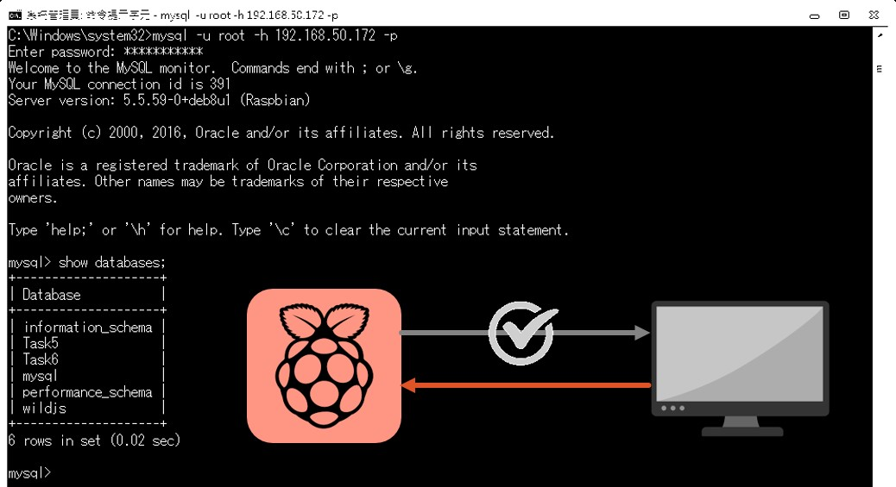
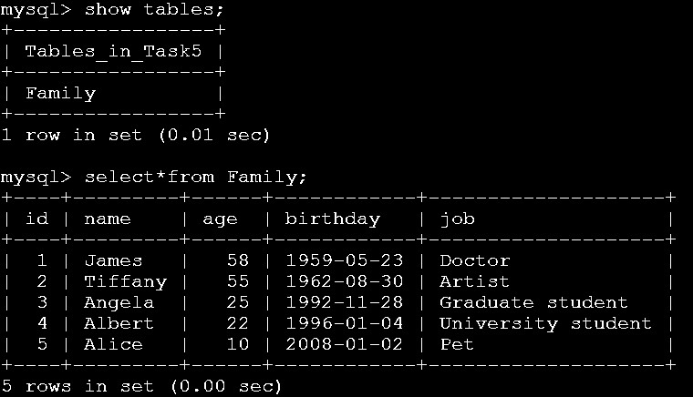
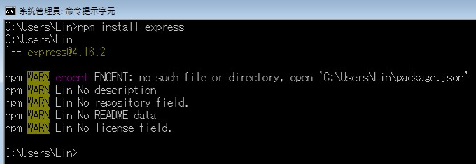
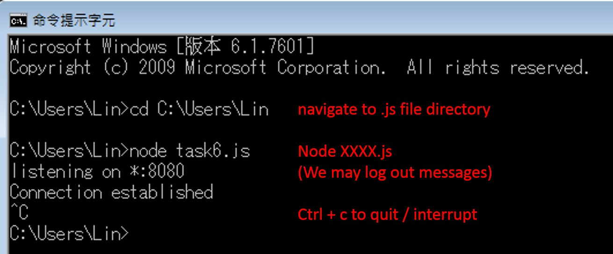
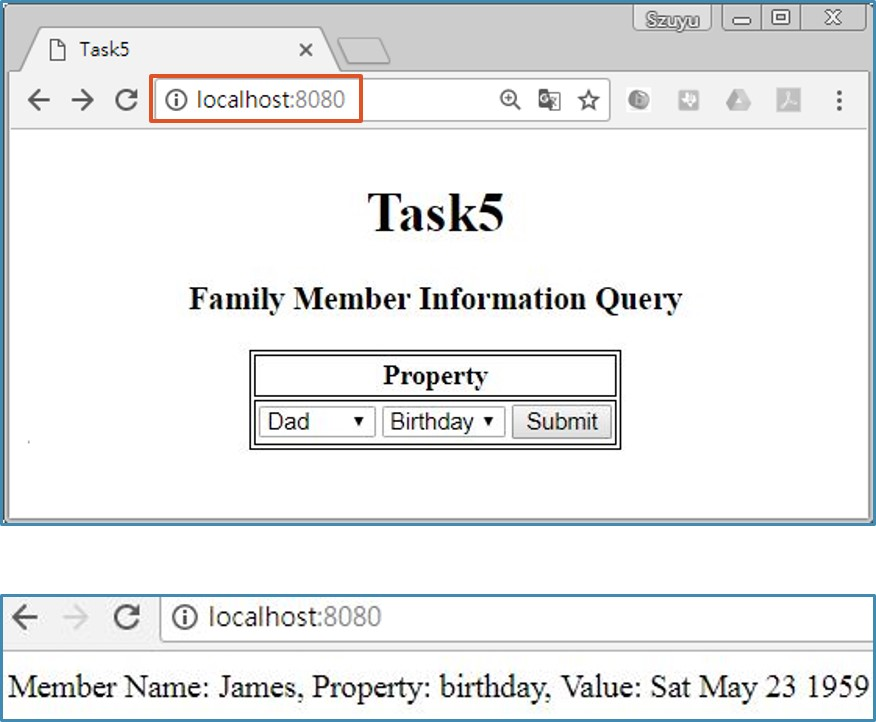

# Automation1062_Task5
## Mysql setup
### Install mysql server
$ sudo apt-get update  
$ sudo apt-get install mysql-server mysql-client  
(Password for mysql root will be required.)  
 

### Modify config file
$ sudo nano /etc/mysql/my.cnf  
Enable remote connection: comment out following line (47)  
bind-address = 127.0.0.1  
 

### Login by Raspberry Pi command line
$ mysql -u root -p  
Enter password: (the one we just set)  
 

### Modify remote connection privileges
(username: 'root', host: local computer IP)  
mysql> GRANT ALL PRIVILEGES ON *.* TO 'username'@'host' IDENTIFIED BY 'password';  
mysql> FLUSH PRIVILEGES;  
 

### Login to Raspberry Pi's Mysql server from LOCAL computer
  
$ mysql -u root –h 192.168.XXX.XXX –p (Raspberry pi IP)  
 

## Task setup
### Insert test data
  
mysql> CREATE DATABASE Task5;  
mysql> USE Task5;  
mysql> CREATE TABLE Family (id INT AUTO_INCREMENT PRIMARY KEY, name VARCHAR(255), age INT(255), birthday DATE, job VARCHAR(255));  
mysql> INSERT INTO Family (name, age, birthday, job) VALUES ('James', 58, '1959-05-23', 'Doctor'), ('Tiffany', 55, '1962-08-30', 'Artist'), ('Angela', 25, '1992-11-28', 'Graduate student'), ('Albert', 22, '1996-01-04', 'University student'), ('Alice', 10, '2008-01-02', 'Pet');  

## Local computer side
### npm installation tool
npm installation tool is already installed when node.js is.  
  
open cmd.exe  
npm install express  
npm install mysql  
  
### Run a node.js program
  
node task5.js
  
### View html page in browser
  
Open web browser, and in the url bar type in: localhost:8080  
  
